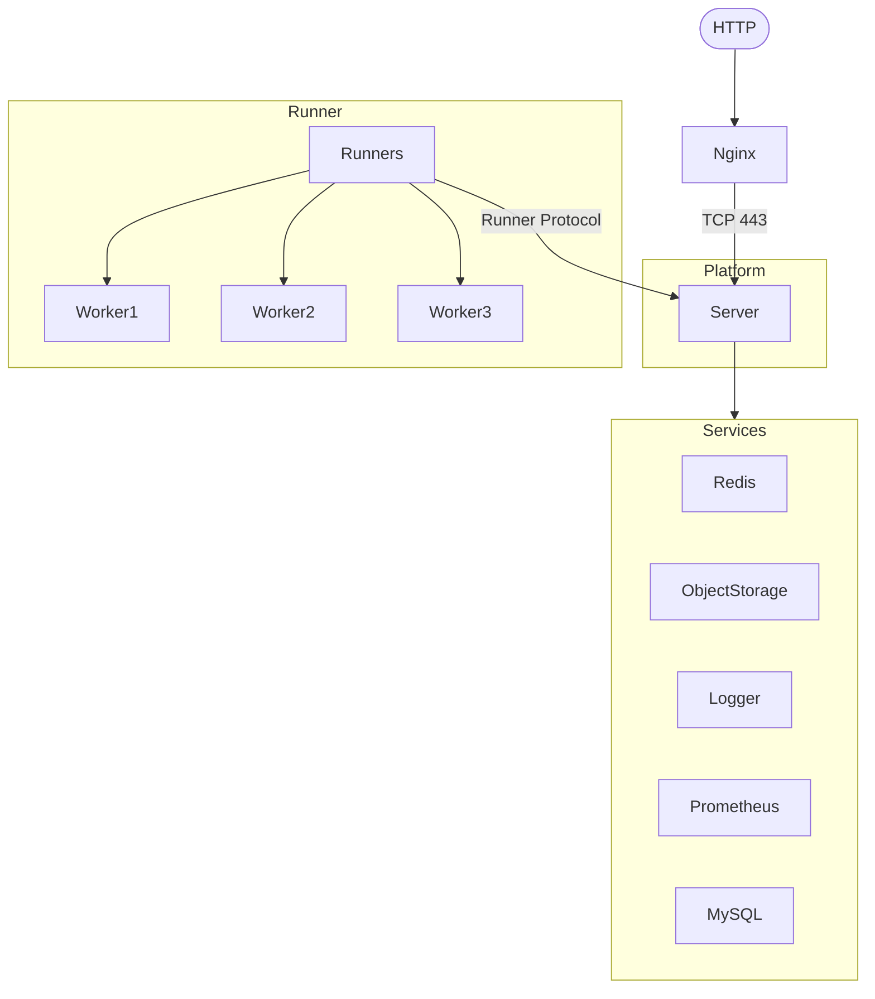

# Architecture

## Tech Stack

### Frontend

- React
- GraphQL
- Sigi

### Backend

- NestJS

## Directory Structure

Perfsee is a monorepo and uses Yarn 3 and some custom scripts to manage. All projects are stored in the `packages` directory. The general directory structure is as follows:

```
.
├── .local-object-storage            // Local object storage, used to store development storage for easy viewing
├── assets                           // Project resource files, such as logo, favicon, etc.
├── db                               // Database snapshots and migration files generated during development
├── docs                             // The directory where this document is stored
├── examples                         // Some brief examples of using the platform tools
├── packages                         // The directory where all source code is stored, each project exists as a subdirectory
│   ├── bundle-analyzer              // Bundle analysis implementation
│   ├── bundle-report                // Display logic for analyzing the bundle report
│   ├── components                   // Custom components that are not related to the front-end business logic
│   ├── dls                          // Front-end page design related definitions
│   ├── flamechart                   // WebGL-based flame chart component
│   ├── ori                          // Source analysis implementation
│   ├── platform                     // Front-end business code
│   ├── platform-server              // Backend business code
│   ├── plugins                      // The directory where all packaging tool plugins are stored, each plugin source code is stored by name
│   │   ├── esbuild
│   │   ├── rollup
│   │   ├── utils
│   │   └── webpack
│   ├── runner                       // Analysis task execution Runner logic
│   │   ├── executor                 // Analysis task control logic, containing content related to interaction with the platform backend
│   │   ├── bundle                   // bundle analysis runner script
│   │   ├── lab                      // Lab analysis runner script
│   │   ├── source                   // Source analysis runner script
│   │   └── shared                   // Analysis task shared logic
│   ├── shared                       // Shared code between the frontend and backend
│   ├── treemap                      // WebGL-based treemap component
│   ├── utils                        // Common utilities
│   └── vscode-extension             // VSCode extension
├── tools                            // Some tools used in the development process
├── tsconfigs                        // TypeScript configuration files for different scenarios
└── types                            // Type definition files
```

## System Architecture

This is a simplified architecture diagram for understanding the architecture of the entire Perfsee project.



## Components & Dependencies

In the architecture diagram above, we can see that to run Perfsee, we need to prepare some components and dependencies. The role of these components and dependencies is as follows:

### Components list

- ✅ - Installed by default
- ⚙️ - Requires additional configuration
- ⬇️ - Manual installation required
- ❌ - Not supported or need to be implemented

| Component              | Description                                        | Perfsee.com | Self Hosted |
| ---------------------- | -------------------------------------------------- | ----------- | ----------- |
| Nginx                  | Routes requests                                    | ✅          | ⬇️          |
| Redis                  | Cache                                              | ✅          | ⬇️          |
| MySQL                  | Database                                           | ✅          | ⬇️          |
| Object Storage         | Local non-persistent single machine object storage | ❌          | ✅          |
| Object Storage Service | Persistent object storage service provider         | ✅          | ❌ ️        |
| Prometheus             | Monitoring                                         | ✅          | ⬇️          |
| Logger                 | Command line log                                   | ✅          | ✅          |
| Logger Service         | Persistent log service provider                    | ✅          | ❌ ️        |
| Runner                 | Analysis task executor                             | ✅          | ⚙️          |
| Email (SMTP)           | Send platform, task status notifications to users  | ✅          | ⚙️          |
| GitHub Bot             | Used to feedback PRs as a robot                    | ✅          | ⚙️          |
| Notification Service   | Other notification service providers               | ✅          | ❌ ️        |
| Github OAuth           | Github OAuth login                                 | ✅          | ⚙️          |
| Custom OAuth           | Other OAuth service providers                      | ❌          | ❌ ️        |
