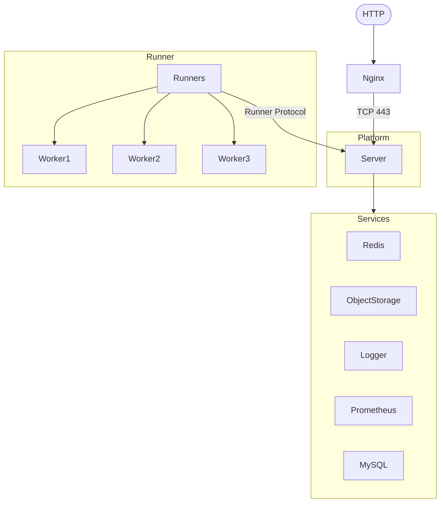

# 项目架构

## 技术栈

### 前端

- React
- GraphQL
- Sigi

### 后端

- NestJS

## 目录结构

Perfsee 是一个 Monorepo，并且使用 Yarn 3 及一些自定义脚本管理，所有的项目均存放在 `packages` 目录下，项目大体的目录结构如下所示：

```
.
├── .local-object-storage            // 本地对象存储，用于存储开发时存储方便查看
├── assets                           // 项目资源文件，如 logo, favicon 等
├── db                               // 数据库快照及迭代过程中生成的迁移文件
├── docs                             // 本文档的存放目录
├── examples                         // 一些使用平台工具的简要例子
├── packages                         // 所有源代码的存放目录，各个项目以子目录的形式存在
│   ├── bundle-analyzer              // 打包产物分析的核心逻辑
│   ├── bundle-report                // 打包产物分析报告的展示逻辑
│   ├── components                   // 与前端业务逻辑无关的自定义组件
│   ├── dls                          // 前端页面设计相关的定义
│   ├── flamechart                   // 基于 WebGL 的火焰图组件
│   ├── ori                          // 源码分析模块
│   ├── platform                     // 前端业务代码
│   ├── platform-server              // 后端业务代码
│   ├── plugins                      // 所有的打包工具插件存放目录，各插件源码按名称存放
│   │   ├── esbuild
│   │   ├── rollup
│   │   ├── utils
│   │   └── webpack
│   ├── runner                       // 分析任务执行 Runner 逻辑
│   │   ├── executor                 // 分析任务控制逻辑，存放与平台后端交互的内容
│   │   ├── bundle                   // 打包产物分析脚本
│   │   ├── lab                      // 页面运行时分析脚本
│   │   ├── source                   // 源码分析脚本
│   │   └── shared                   // 分析运行时通用代码
│   ├── schema                       // 前端与后端的 GraphQL Schema 定义
│   ├── sdk                          // 用于与平台交互的 Node SDK 代码
│   ├── server-common                // 后端通用代码
│   ├── shared                       // 前后端通用代码
│   ├── treemap                      // 基于 WebGL 的树状图组件
│   ├── utils                        // 前后端、Runner、插件等通用逻辑
│   └── vscode-extension             // Perfsee VS Code 插件
├── tools                            // 项目开发脚手架
├── tsconfigs                        // 面向不同使用方式的 tsconfig 配置
└── types                            // 自定义 TS 类型
```

## 项目架构

这是一个简版的架构图，用于理解 Perfsee 整个项目的架构。



## 组件 & 依赖

在上面的架构图中可以看到，想要 Perfsee 运行起来，需要准备一些组件和依赖。这些组件和依赖的作用如下：

### 组件列表

- ✅ - 默认安装
- ⚙️ - 需要额外配置
- ⬇️ - 外部依赖，需要手动安装
- ❌ - 不支持，或需要自行实现

| 组件名称               | 说明                           | Perfsee.com | 私有部署 |
| ---------------------- | ------------------------------ | ----------- | -------- |
| Nginx                  | 反向代理                       | ✅          | ⬇️       |
| Redis                  | 缓存                           | ✅          | ⬇️       |
| MySQL                  | 数据库                         | ✅          | ⬇️       |
| Object Storage         | 没有持久化的本地单机对象存储   | ❌          | ✅       |
| Object Storage Service | 持久化对象存储服务提供商       | ✅          | ❌ ️     |
| Prometheus             | 监控                           | ✅          | ⬇️       |
| Logger                 | 命令行日志                     | ✅          | ✅       |
| Logger Service         | 持久化日志服务提供商           | ✅          | ❌ ️     |
| Runner                 | 分析任务执行器                 | ✅          | ⚙️       |
| Email (SMTP)           | 给用户发送平台、任务状态等通知 | ✅          | ⚙️       |
| GitHub Bot             | 用于反馈 PR 的机器人           | ✅          | ⚙️       |
| Notification Service   | 其他通知服务提供商             | ✅          | ❌ ️     |
| Github OAuth           | Github OAuth 登录              | ✅          | ⚙️       |
| Custom OAuth           | 其他 OAuth 服务提供商          | ❌          | ❌ ️     |
