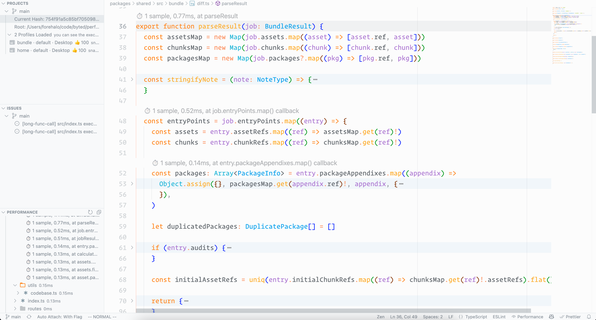

The Perfsee official vscode extension.

## Features

- Authentication with Perfsee
- Retrieve and view runtime flame graphs in the editor
- Codelens for function execution costs
- Aggregated folder execution costs in the tree view

For more detail, please refer our [docs](https://perfsee.com/docs)
